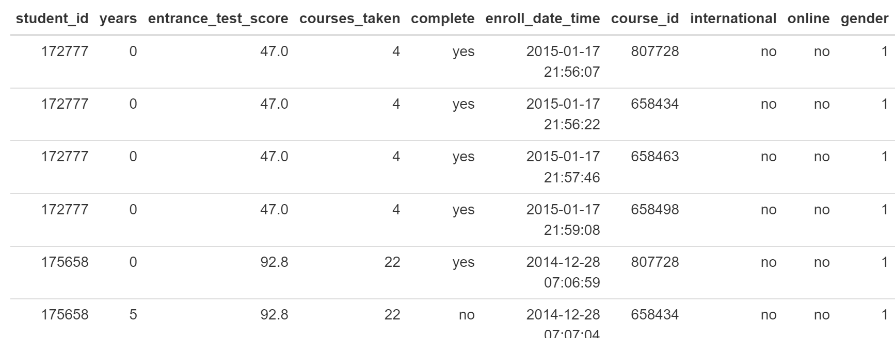

## Background on Prediction

Prediction of student behavior has been a prominant area of research in learning analytics and a major concern for higher education institutions and ed tech companies alike. It is the bedrock of [methodology within the world of cognitive tutors](https://solaresearch.org/hla-17/hla17-chapter5/) and these methods have been exported to other areas within the education technology landscape. The ability to predict what a student is likely to do in the future so that interventions can be tailored to them has seen major growth and investment, [though implementation is non-trivial and expensive](https://www.newamerica.org/education-policy/policy-papers/promise-and-peril-predictive-analytics-higher-education/). Although some institutions, such as [Purdue University](https://www.itap.purdue.edu/learning/tools/forecast.html), have seen success we are yet to see widespread adoption of these approaches as they tend to be highly institution specific and require very concrete outcomes to be useful. 

## Project Goals

* Construct classification algorithms to predict student dropout
* Compare the accuracy of three models: CART, Conditional Inference Tree, and C5.0

## Data Set
The data comes from an unnamed university registrar's office. 
Below are definitions for each of the variables and six example rows:

* student_id = Student ID
* years = Number of years the student has been enrolled in their program of study
* entrance_test_score = Entrance exam test score
* courses_taken = Number of courses a student has taken during their program
* complete = Whether or not a student completed a course or dropped out (yes = completed)
* enroll_data_time = Date and time student enrolled in POSIXct format
* course_id = Course ID
* international = Is the student from overseas
* online = Is the student only taking online courses
* gender = One of five possible gender identities

## Exploratory Analysis

## Modeling

## Comparison

## Resources

* [The caret package](https://topepo.github.io/caret/train-models-by-tag.html)
* [The C50 package](https://topepo.github.io/C5.0/)

