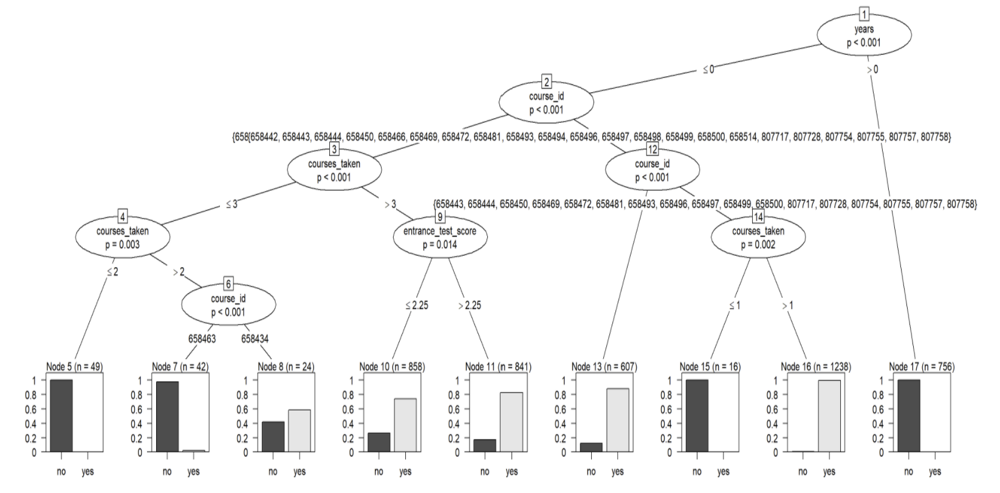

## Project Goals

* Construct classification algorithms to predict student dropout
* Compare the accuracy of three models: CART, Conditional Inference Tree, and C5.0

## Data Set
The data comes from an unnamed university registrar's office. 
Below are definitions for each of the variables and six example rows:

* student_id = Student ID
* years = Number of years the student has been enrolled in their program of study
* entrance_test_score = Entrance exam test score
* courses_taken = Number of courses a student has taken during their program
* complete = Whether or not a student completed a course or dropped out (yes = completed)
* enroll_data_time = Date and time student enrolled in POSIXct format
* course_id = Course ID
* international = Is the student from overseas
* online = Is the student only taking online courses
* gender = One of five possible gender identities

## Exploratory Analysis

Associations were analyzed between each pair of variables using ggpairs. There were two key findings:

1. The correlation between each pair of continuous variables (Entrance test score, Courses taken, and Date of enrollment) was significant in every case. 

  * The most significant relationship was between entrance test score and time of enrollment (r = -.369). This makes sense because the higher score someone gets on an entrance exam, the more prepared they are for a class and the more likely they are to have a higher number of credits entering University. Colleges often schedule registration dates by number of credits; students with more credits can schedule first.

  * For the same reason, it is also sensible why there would be a negative correlation between courses taken and date of enrollment and why there would be a positive relationship between entrance test score and courses taken.

2. There were no notable categorical associations.

## Modeling

* Data were separated into a train and test dataframe, with 75% of the rows in test.
* Data were centered and scaled to make the weights of the variables uniform regardless of the model.
* Three models within the caret package were used: "rpart", "ctree" and "C5.0" 
* K-fold cross validation was applied to all of the models, and the final model choice was made according to the sensitivity metric.

## Model Example: Conditional Inference Tree

Below is a plot illustrating the parameters selected by the conditional inference tree model and the associated classification distributions. Scaling and normalization in this model instance were not performed to enhance interpretability of the tree plot.

* The model has several branches with many variables directing the classification: years, entrance test score, total courses taken, and course_id.

* Similarly to the rpart model, it is clear that having been enrolled in a program at the University for a longer period of time before taking a course is an excellent predictor of completion, with more years resulting in zero chance of completion.

* More total courses taken seems to result in a lower chance of completion. This might be because it is correlated with the years of study variable, which is also inversely related to successful completion.

* Entrance test score was not an attribute of the rpart model but was in this model. It appears just once as a final decision node, but it does end up slightly impacting the probability of completion of about 1700 students in the train data.

## Comparison

#

## Resources

* [The caret package](https://topepo.github.io/caret/train-models-by-tag.html)
* [The C50 package](https://topepo.github.io/C5.0/)

